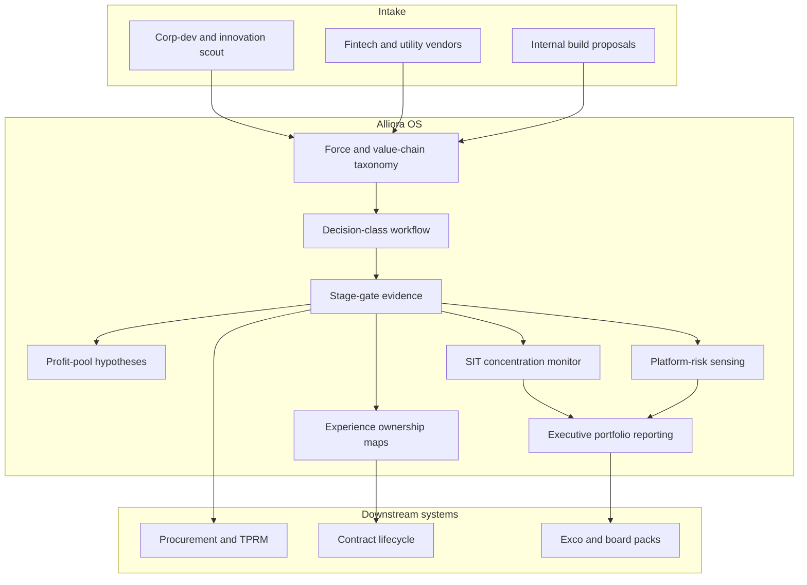

# Alliora

**Source:** `ai-in-financial/wef_-_beyond_fintech_-_a_pragmatic_assessment_of_disruptive_potential_in_financial_services_-_august_2017/`
**Domain:** `ai-fin`
**One-liner:** A pragmatic alliance-and-capability OS that helps incumbent financial institutions shop, score, contract, and govern fintech partnerships across eight disruptive forces — without confusing a “capability supermarket” with a strategy.
**Wedge:** Group strategy and corporate development teams at universal and large regional banks that run dozens of fintech pilots and need a kill/scale/mutualise system tied to experience ownership and profit-pool shifts.
**Positioning:** Beyond-fintech operating system for incumbents. The 2017 WEF assessment concludes fintechs changed the basis of competition more than the competitive landscape; the lasting threat is tempo and bigtech-capable platform entry. Alliora turns that pragmatic diagnosis into a portfolio machine for mutualise / externalise / automate decisions and platform-risk governance.

## Market research synthesis

### Thesis from source

*Beyond Fintech* takes stock after the first wave of disruption anxiety. Fintechs (defined as small, technology-enabled new entrants) seized initiative on direction, shape, and pace of innovation and raised the UX bar to bigtech standards (e.g., rapid loan adjudication). They largely failed to displace incumbents as dominant players: customer switching costs were underestimated; innovations were often not material enough to justify switching once incumbents adapted; and fintechs struggled to build alternative infrastructure (payment rails, capital markets), succeeding more inside traditional ecosystems. Conclusion: basis of competition changed; competitive landscape largely did not — with caveats where incumbents were absent or neglected segments.

Yet fintechs laid foundations for future disruption. Incumbents externalise innovation (wait-and-see, then copy or partner) and treat the ecosystem as a “supermarket” for capabilities via acquisition and partnership. That agility is not a traditional core competence, and the same supermarket is available to new entrants and bigtech — lowering barriers to entry. The report identifies eight disruptive forces: (1) Cost Commoditization via mutualisation, externalisation, and automation (e.g., national KYC utilities, Aladdin-like platforms, process automation); (2) Profit Redistribution across and within value chains; (3) Experience Ownership shifting power to interface owners; (4) Platforms Rising as the dominant delivery model; (5) Data Monetization from multi-source real-time flows; (6) Bionic Workforce combining labour and capital as one capability set; (7) Systemically Important Techs as critical infrastructure dependencies; (8) Financial Regionalization under diverging regulation and customer needs.

Alliora’s product job is the missing operating layer: force-aligned scoring of capabilities, explicit choose-to-mutualise vs build vs partner, experience-ownership and liability maps with distributors, and concentration monitoring for systemically important tech dependencies — so “we partnered with 40 fintechs” stops being mistaken for resilience.

### Buyer & economic model

- **Primary buyer:** Chief Strategy Officer / Head of Corporate Development / Head of Innovation Portfolio, with CIO and CRO as veto stakeholders on tech concentration and outsourcing.
- **Users:** partnership managers, venture/arm’s-length investment teams, business-line product owners, procurement, model/ops risk, legal (liability sharing), finance (build-vs-buy cases).
- **Budget owner / value metric:** innovation and partnership budget plus avoided duplicate cost. Metrics: time from discovery to contracted pilot; % pilots killed by day-90 evidence gates; cost mutualised vs duplicated; revenue/profit shift attributed to platform vs manufacturer roles; SIT (systemically important tech) concentration index.
- **Competing status quo:** slide-deck radar maps, CRM-as-partner-list, procurement tools without force taxonomy, and innovation theatres that never connect to experience-ownership or profit-pool P&L.

### Domain constraints

- **Regulatory / trust / safety:** outsourcing and third-party risk rules; operational resilience; consumer duty when distributors own experience; liability allocation between manufacturer and distributor; concentration risk in critical tech providers; regional licensing divergence (force 8).
- **Data sensitivity:** shared customer data in partnerships; competitive intelligence on partner performance; investment pipeline confidentiality.
- **Change-management realities:** business lines bypass central innovation; everyone wants to “be the platform”; fintech partners fear procurement death. Alliora must enforce stage gates with evidence, not more intake forms, and must make experience-ownership an explicit choice with P&L consequences.

## Business requirements

- BR-1: Every capability or partnership under review must be tagged to one or more of the eight disruptive forces and to a primary value-chain position (manufacture, distribute, infrastructure, data, labour-augmentation).
- BR-2: Intake must force a decision class — mutualise, externalise, automate, build, invest, or decline — with a named economic owner.
- BR-3: Experience-ownership must be declared for each customer journey touched: who owns UX, data, brand, complaints, and liability.
- BR-4: Profit-pool hypotheses (who gains/loses margin) must be stated before pilot funding and tested at stage gates.
- BR-5: Day-30/90/180 evidence gates must include customer switching materiality, unit economics, and operational risk — pilots cannot renew on narrative alone.
- BR-6: Systemically important tech dependencies must be inventoried with concentration limits, exit plans, and board-visible breach alerts.
- BR-7: Cost-commoditisation opportunities (shared KYC utility, industry platforms, automation) must be comparable against duplicate internal spend.
- BR-8: Regionalisation constraints (licence, data residency, conduct rules) must block global copy-paste of a partner model that only works in one regime.
- BR-9: Platform-risk monitoring must flag when a distributor partner captures interface power sufficient to reprice or disintermediate the bank’s products.
- BR-10: Bionic-workforce plans must map which roles are augmented vs replaced and require HR/conduct sign-off before automation scale-up.
- BR-11: Legal must capture liability-sharing terms between manufacturers and distributors as structured data, not only PDF contracts.
- BR-12: Portfolio reporting to the executive committee must show force coverage, kill rate, and SIT concentration — not a vanity count of fintech logos.

## User stories

Canonical user stories live in sibling [USER_STORIES.md](USER_STORIES.md).

## System design

### Overview

Alliora is a portfolio control plane. Strategy teams ingest capabilities (fintechs, utilities, internal builds). Each item is force-tagged, value-chain positioned, and routed into a decision class. Stage gates collect evidence on switching materiality, economics, and risk. Experience-ownership and liability maps bind to contracts. SIT and platform-risk monitors watch concentration and interface power. Executive reporting aggregates kill rates, force coverage, and dependency heat. Integrations push approved partners into procurement and third-party-risk systems of record.

### Actors & boundaries

- **Actors:** CSO/corp-dev, business lines, fintech/vendors (external), procurement, risk, legal, HR, board/exco consumers, Alliora admin.
- **Trust boundary:** Alliora holds portfolio, scoring, and governance state — not customer production data by default. Production data sharing remains under separate outsourcing arrangements referenced by the partnership record.
- **Human-in-the-loop points:** stage-gate approvals; SIT limit exceptions; kill/scale decisions; liability negotiation; board acceptance of concentration risk.

### Core capabilities

1. **Capability intake and taxonomy** — eight forces + value-chain position.
2. **Decision-class workflow** — mutualise/externalise/automate/build/invest/decline.
3. **Stage-gate evidence** — materiality, economics, risk.
4. **Experience-ownership maps** — UX, brand, data, complaints, liability.
5. **Profit-pool hypotheses and tests** — pre/post funding.
6. **SIT concentration monitoring** — critical tech dependencies.
7. **Platform-risk sensing** — distributor interface power.
8. **Cost-commoditisation comparisons** — duplicate vs mutualise.
9. **Regionalisation constraints** — licence and residency gates.
10. **Executive portfolio reporting** — kill rate, coverage, alerts.

### Conceptual data

- **Primary entities:** Capability, ForceTag, ValueChainPosition, DecisionClass, StageGate, EvidencePack, ExperienceOwnershipMap, LiabilityTerms, ProfitPoolHypothesis, PartnershipContract, SitDependency, PlatformRiskAlert, RegionalConstraint, PortfolioReport.
- **Critical events:** capability submitted, force-tagged, gate passed/failed, killed/scaled, SIT limit breached, platform-risk alert raised, liability executed, report published.
- **Retention / audit needs:** gate evidence, contracts, liability maps, and kill rationales retained for audit and regulatory outsourcing reviews; investment pipeline confidentiality controls applied.

### Integrations (conceptual)

- **Systems of record:** procurement, third-party risk, legal contract lifecycle, venture cap table tools, IT service management.
- **Upstream signals:** market intel feeds, vendor security questionnaires, business-line KPI systems, open-banking/platform analytics for interface power.
- **Downstream actions:** procurement onboarding, access provisioning, board packs, kill notifications, budget releases.

### High-level architecture

Strategy taxonomy and gates sit above vendor tools. Alliora does not replace procurement — it decides what deserves to enter procurement.

### Success metrics

- **Leading:** % opportunities force-tagged before funding; median days to day-90 gate; gate fail/kill rate; % contracts with complete experience-ownership maps; SIT inventory coverage.
- **Lagging:** duplicate cost avoided via mutualisation; profit retained vs redistributed in platform partnerships; reduction in unmanaged critical vendors; board acceptance of portfolio reports without narrative-only pilots; successful scale rate of gated partnerships.

## OpenAPI skeleton

Canonical HTTP surface lives in sibling [openapi.yaml](openapi.yaml). Summary:

- **Base path:** `/v1/...`
- **Auth:** `X-API-Key` for IT/procurement integration; Bearer JWT for strategy and risk operators.
- **Resource groups:** Capabilities, Decisions, StageGates, ExperienceMaps, Dependencies, Alerts, Reports.
