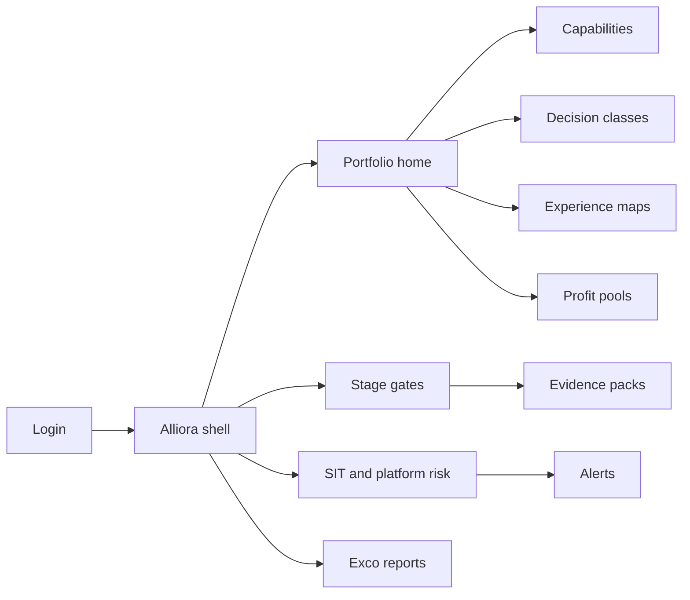
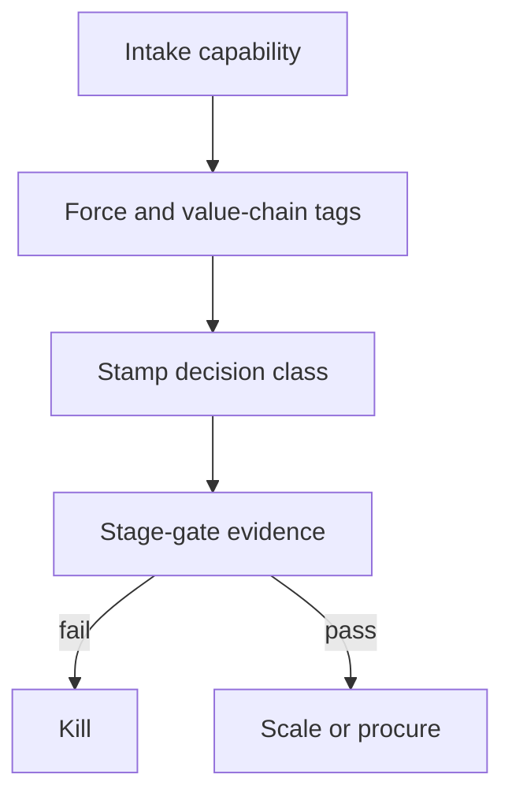

# Alliora — Web app

**Product:** [PRODUCT.md](./PRODUCT.md)
**Primary surface:** Alliance-and-capability portfolio console (CSO / corp-dev / partnership / risk / legal workspaces)
**Secondary surfaces:** Fintech vendor intake form (external, limited); exco portfolio report viewer
**Design thesis:** Alliora is a capability supermarket checkout with a strategy receipt — the UI metaphor is force-tagged shopping and kill/scale gates, not an innovation lab logo wall. Visual language is charcoal and electric cyan on cool concrete panels: decision classes feel like stamped tickets (mutualise / externalise / automate / build / invest / decline); missing experience-ownership feels like an open liability gap; SIT concentration feels like a red dependency fuse. The Alliora wordmark sits as a quiet merchant stamp on every gate and report so exco knows whose pragmatic beyond-fintech ledger they are reading—not a vanity partner count.

## UX research synthesis

### Category peers (best-in-class)

- **Affinity / DealCloud (corp-dev CRM):** Pipeline hygiene for partnerships and investments. Steal: stage discipline and owner accountability; reject CRM-as-strategy without eight-force taxonomy.
- **ServiceNow Strategic Portfolio / innovation OS patterns:** Kill/scale evidence gates. Steal: day-30/90/180 materiality gates (BR-5); reject narrative renewal without economics/risk evidence.
- **Whistic / ProcessUnity TPRM:** Third-party concentration and exit plans. Steal: SIT inventory with spend blocks on missing exit plans (BR-6); reject partner-by-partner theatre without portfolio concentration.
- **Contract lifecycle UIs (Icertis-like structured terms):** Liability as data. Steal: manufacturer/distributor liability fields blocking go-live (BR-11); reject PDF-only accountability.

### Patterns to adopt / reject

- **Adopt:** Eight-force tags + value-chain position; mandatory decision class; experience-ownership maps (UX, brand, data, complaints, liability); profit-pool hypotheses before funding; SIT concentration and platform-risk alerts; mutualise-vs-duplicate cost compare; regionalisation blocks; bionic workforce HR sign-off; exco report = force coverage + kill rate + SIT — not logo count.
- **Reject:** Fintech logo walls; purple “disruption score”; radar maps as the only artefact; everyone-is-the-platform without P&L; intake forms without gates.

### Trust, density, and workflow constraints from PRODUCT.md

Alliora holds portfolio governance, not customer production data (trust boundary). Outsourcing/resilience and consumer duty when distributors own experience constrain UX. Business lines bypass central innovation — gates must be evidence-based. Fintechs fear procurement death — decision class should clarify path before full TPRM. Regional licence divergence blocks global copy-paste (BR-8).

## Information architecture

### Nav model

### Roles → default home

| Role | Default home | Why |
|------|--------------|-----|
| Chief strategy officer | Portfolio — force coverage + kill rate | Motion ≠ progress (BR-12) |
| Partnerships / corp-dev | Capability scorecards | Compare beyond “better app” |
| Business-line product owner | My journeys / profit pools | Spot self-disintermediation (BR-4, BR-9) |
| Third-party risk / resilience | SIT concentration | Exit plans (BR-6) |
| Legal counsel | Experience maps / liability | Block go-live if unsigned (BR-11) |
| HR business partner | Bionic workforce maps | Sign-off before automation scale (BR-10) |
| Exco / board | Portfolio report viewer | Force + kill + SIT |

### Cross-links to OpenAPI resources

| Nav area | OpenAPI tags / resources |
|----------|---------------------------|
| Capability intake / forces | Capabilities |
| Mutualise / build / etc. | Decisions |
| Day-30/90/180 gates | StageGates |
| UX / liability ownership | ExperienceMaps |
| SIT dependencies | Dependencies |
| Platform-risk / concentration | Alerts |
| Exco packs | Reports |

## Screen inventory

### Portfolio home

- **Purpose:** Answer “are we shopping capabilities with strategy, or collecting fintech logos?”
- **Entry:** CSO default.
- **Layout regions:** Brand stamp; eight-force coverage heat; kill rate; decision-class mix; SIT breach count; platform-risk alerts; top capabilities table.
- **Primary actions:** Open capability; open overdue gates; publish exco report.
- **Empty / loading / error:** Empty = intake first capability with force tags; error = retry with request id.
- **BR / story ties:** BR-1, BR-12; CSO stories.

### Capability intake and scorecard

- **Purpose:** Force-tag, value-chain position, and compare candidates beyond UX gloss.
- **Entry:** Corp-dev; scout intake.
- **Layout regions:** Force multi-select; value-chain position; scorecard (economics, risk, liability readiness); competitor compare; regional fit.
- **Primary actions:** Submit; assign economic owner; route to decision class.
- **Empty / loading / error:** Untagged forces block funding (BR-1).
- **BR / story ties:** BR-1; partnerships manager stories.

### Decision-class workflow

- **Purpose:** Force mutualise / externalise / automate / build / invest / decline with named owner.
- **Entry:** From scorecard.
- **Layout regions:** Decision tickets; owner; rationale; link to cost-commoditisation compare when mutualise.
- **Primary actions:** Stamp decision; decline; send to gates or procurement path.
- **Empty / loading / error:** Missing owner = cannot stamp (BR-2).
- **BR / story ties:** BR-2, BR-7.

### Stage-gate evidence workspace

- **Purpose:** Day-30/90/180 gates on switching materiality, unit economics, operational risk — no narrative renewals.
- **Entry:** Gates nav; PMO queue.
- **Layout regions:** Gate timeline; evidence checklist; kill/scale recommendation; exception log.
- **Primary actions:** Pass; kill; scale; renew blocked without evidence.
- **Empty / loading / error:** Missing evidence pack = fail gate (BR-5).
- **BR / story ties:** BR-5; CSO kill stories.

### Experience-ownership map

- **Purpose:** Declare who owns UX, data, brand, complaints, liability before legal review.
- **Entry:** Pre-contract; product owner.
- **Layout regions:** Journey map; ownership matrix; gaps in coral; link to liability terms.
- **Primary actions:** Assign owners; send to legal; block go-live if incomplete.
- **Empty / loading / error:** Unsigned liability = go-live block (BR-3, BR-11).
- **BR / story ties:** BR-3, BR-11; legal stories.

### Profit-pool hypothesis board

- **Purpose:** Who gains/loses margin before funding; test at gates.
- **Entry:** Product owner; gate context.
- **Layout regions:** Hypothesis cards; manufacturer vs distributor margin; post-gate test results.
- **Primary actions:** State hypothesis; attach gate test; escalate disintermediation risk.
- **Empty / loading / error:** No hypothesis = funding block (BR-4).
- **BR / story ties:** BR-4.

### Cost-commoditisation compare

- **Purpose:** Shared KYC/utility/automation vs duplicate internal spend.
- **Entry:** From mutualise decision; procurement.
- **Layout regions:** Duplicate spend tally; mutualise option; savings case.
- **Primary actions:** Choose mutualise; keep build with rationale.
- **Empty / loading / error:** Incomplete spend data = amber estimate mode (BR-7).
- **BR / story ties:** BR-7; procurement stories.

### SIT concentration monitor

- **Purpose:** Systemically important tech inventory, limits, exit plans, board-visible breaches.
- **Entry:** Risk default.
- **Layout regions:** Dependency heat; concentration index; exit-plan status; spend-block banner.
- **Primary actions:** Add dependency; attach exit plan; request limit exception; block new spend.
- **Empty / loading / error:** Missing exit plan = new spend blocked (BR-6).
- **BR / story ties:** BR-6; resilience stories.

### Platform-risk alerts

- **Purpose:** Flag when distributor captures interface power to reprice or disintermediate.
- **Entry:** Alerts nav; product owner notifications.
- **Layout regions:** Alert queue; interface-power signals; renegotiation tasks.
- **Primary actions:** Acknowledge; open renegotiation; escalate to CSO.
- **Empty / loading / error:** Empty = healthy message (BR-9).
- **BR / story ties:** BR-9.

### Regionalisation constraints

- **Purpose:** Block global copy-paste of partner models that only work in one regime.
- **Entry:** Capability detail; gate check.
- **Layout regions:** Licence / residency / conduct matrix by country; copy-paste warning.
- **Primary actions:** Restrict rollout; approve country set.
- **Empty / loading / error:** Conflict = coral block (BR-8).
- **BR / story ties:** BR-8.

### Bionic workforce map

- **Purpose:** Roles augmented vs replaced with HR/conduct sign-off before automation scale.
- **Entry:** Automate decision path; HR.
- **Layout regions:** Role table; augment/replace; transition funding; sign-off status.
- **Primary actions:** Request HR sign-off; block scale-up until signed (BR-10).
- **Empty / loading / error:** Unsigned = scale blocked.
- **BR / story ties:** BR-10.

### Exco portfolio report

- **Purpose:** Force coverage, kill rate, SIT concentration — not fintech logo vanity.
- **Entry:** Reports; board viewer.
- **Layout regions:** Coverage heat; kill/scale summary; SIT breaches; platform-risk excerpt; publish version.
- **Primary actions:** Generate; publish; download.
- **Empty / loading / error:** Logo-count widgets absent by design (BR-12).
- **BR / story ties:** BR-12.

## Key flows

1. **Shop to gate** — intake capability → force + value-chain tags → decision class → day-30/90 evidence → kill or scale; failure: narrative-only renewal blocked.

2. **Contract with ownership** — experience map → liability terms structured → legal execute → go-live unlock (BR-3, BR-11).

3. **SIT breach** — concentration over limit or missing exit → alert → block spend → exception or remediate (BR-6).

4. **Platform-risk renegotiation** — interface-power alert → product owner + CSO → renegotiate or exit (BR-9).

5. **Mutualise vs duplicate** — compare shared utility cost → stamp mutualise → route to industry utility path (BR-7).

## Design system

### Tokens (CSS variables)

- `--color-ink: #E8EEF2` — text on dark
- `--color-concrete: #1C2128` — app ground
- `--color-panel: #262C36` — panels
- `--color-cyan: #2EC4B6` — decision / action accent
- `--color-fuse-red: #E85D4C` — SIT / platform breach
- `--color-amber: #E6A23C` — provisional gate
- `--color-stamp-green: #3D9B6E` — scaled / executed
- `--color-steel: #8B9AAB` — secondary labels
- `--font-display: "Space Grotesk", sans-serif` — portfolio titles (tempo, not Inter)
- `--font-body: "IBM Plex Sans", sans-serif`
- `--font-mono: "IBM Plex Mono", monospace` — contract and gate ids
- `--space-1`…`--space-8`: 4px scale
- `--radius-sm: 4px`; `--radius-md: 8px`
- `--motion-stamp: 170ms ease-out` — decision class stamp
- `--motion-fuse: 250ms ease-in-out` — SIT breach pulse
- `--motion-gate: 190ms ease-out` — gate pass/fail
- Atmosphere: concrete industrial panels; cyan ticket stamps; no logo wallpaper; no purple disruption nebula.

### Typography & brand

- Space Grotesk for force labels and home titles; Plex for tables; mono for ids.
- Alliora stamp on portfolio and reports; login brand-first (“Shop capabilities; keep the strategy receipt”); one CTA — no partner carousel.

### Do / don’t

- **Do:** Require force tags and decision class; map experience ownership; kill on failed materiality; show SIT concentration; structure liability.
- **Don’t:** Purple AI glow; vanity logo counts; radar-only strategy; editable kill history; emoji force pills; card walls of fintech photos.

### Accessibility & domain trust cues

- Decision stamps include text labels; live regions for SIT and platform alerts.
- Focus order: capability → decision → gate → experience → report.
- Board viewer high contrast; reduced-motion safe heatmaps.

## Component patterns

- **ForceCoverageHeat** — eight disruptive forces coverage.
- **DecisionClassTicket** — mutualise/externalise/automate/build/invest/decline stamp.
- **StageGateEvidencePack** — materiality, economics, risk checklist.
- **ExperienceOwnershipMatrix** — UX/brand/data/complaints/liability.
- **ProfitPoolHypothesisCard** — margin shift pre/post gate.
- **SitConcentrationFuse** — dependency heat with exit-plan lock.
- **PlatformRiskAlertRow** — distributor interface-power signal.
- **RegionalConstraintMatrix** — licence/residency/conduct blocks.
- **BionicRoleMap** — augment vs replace with HR sign-off.
- **ExcoForceReport** — coverage + kill rate + SIT (no logo vanity).

## Out of scope for v1 web

- Replacing procurement or TPRM systems of record; customer-facing fintech apps; venture fund LP portals; native mobile; executing bank products; public fintech marketplace storefront.
